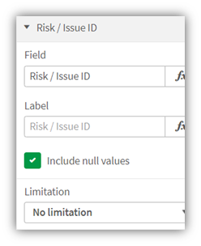

# LeapLytics Risk Heatmap – Extension for Qlik Sense

## Introduction

Get a sharp visual view on your risk profiles with the Risk Heatmap for QilkSense! The extension is built to visualize profiles, that are measured in a matrix of two KPIs and different categories. It is able to visualize multiple indicators (up to 4 in free version) per field. Various settings like an easy switch between a 3x3- and 5x5-field-matrix, border and text settings adapts this extension to your reporting needs.

This extension can also be used for monitoring and indicating thresholds for all types of physical measures, quality indicators and divergences in general. With this, it can be applied to a broad number of uses cases, that occur different businesses. The following listing shows a selection of possible uses cases, that had been already implemented: 

**Project Management**: Visualize risk and opportunity profiles for a project, program or portfolio

**IT**: Indicate applications, that are in green, yellow or red area of status (performance, health) 

---

<h2 align="center">PRO Version</h2>

Interested in a <b>more flexible</b> with <b>even more features</b>? Check out our <a href="https://www.leaplytics.de/risk-heatmap-qliksense-offering/?utm_source=risk-heatmap&utm_medium=github&utm_campaign=above-the-fold" target="_blank">PRO Version here</a>!

---
## Installation

1.  Download the [“Risk Heatmap Master”](https://github.com/leaplytics/risk-heatmap-qlik-sense/tree/master) repository from GitHub

2.  Unzip the downloaded file

3.  Place the folder in your Qlik Sense Extensions directory on your computer (*C:\\Users\\YourUserName\\Documents\\Qlik\\Sense\\Extensions*) or import it with Qlik Management Console (QMC)

There is also a general [installation guide available for Qlik
Sense](https://help.qlik.com/en-US/sense-developer/November2020/Subsystems/Extensions/Content/Sense_Extensions/Howtos/deploy-extensions.htm).

## Getting Started

Open Qlik Sense and the relevant app, where you want to use the “Risk Heatmap” extension. Open your worksheet in edit mode and you will find the extension within the “Custom Objects” section. Drag and Drop the extension to any area on your dashboard (You can change the appearance of the extension later in the advanced settings). 

After you have placed an instance of the extension to your dashboard, the following properties panel will appear on the right side. The properties panel is separated into the following sections:

1. Measures 

2. Dimensions

3. Ranges (general matrix layout)

4. Grid Settings (everything inside the matrix) 

5. Axis Settings (everything around the matrix) 

6. Indicator Settings (everything regarding matrix content) 

7. About

In the following chapters, you will learn how to use LeapLytics “Risk Heatmap” extension and how to customize it to your needs by using the properties correctly.

### Measures

The measure defines the value for the relevant two KPIs of the matrix. The first KPI defines the X-Axis-KPIs and the second KPI defines the Y-Axis-KPI. They can be switched individually. The matrix is expecting values in the range between 1 and 5 (5-field-matrix) or 1 and 3 (3-field-matrix). Also decimals are possible, if useful. The values can be taken from the data model directly, if a pre-system is already capturing and calculating the range. If the data model includes any kind of units, the categories can be created within the formular individually.

You can add a measure like this:  

1. Click the “Add measure” button in the properties panel under the section “Measure” or by clicking the “Add measure” button inside the extension window on your dashboard 

2. Choose a measure from the dropdown list and click on it 

3. (Optional): Choose the right aggregation for your needs (Sum, Avg, Min, Max, etc.) or define an individual formula.  

### Dimensions

Use the dimension in order to give the indicators a striking name. This can be e.g. an ID or short-name (1-2 words). Longer names or descriptions are not recommended, as the space of the matrix itself is limited.

## Advanced Settings

### Grid Settings

Use the Grid Settings to configure the matrix itself. Switch between a 3x3 or 5x5-field Axis and configure the borders. You can also invert the colour-coding, that a higher category has the colour “green” and a lower category is turning into red. It is also possible to switch off the table with detailed values.  

### Axis Settings

The Axis settings let you configure the frame to your needs. You can decide to switch off texts, axis or high/low-indication.

### Indicator Settings

Use the indicator settings in order to change the size and appearance of the indicators in the Grid.  

## About

This Qlik Sense extension is developed by
[LeapLytics](https://www.leaplytics.de/).

### Compatibility 

This extension has been tested with:

[Qlik Sense
2020/11](https://help.qlik.com/en-US/sense-developer/November2020/Content/Sense_Helpsites/WhatsNew/What-is-new-developer-Nov2020.htm)

[Qlik Sense
2020/09](https://help.qlik.com/en-US/sense-developer/September2020/Content/Sense_Helpsites/WhatsNew/What-is-new-developer-Sept2020.htm)

[Qlik Sense
2019/09](https://help.qlik.com/en-US/sense-developer/September2019/Content/Sense_Helpsites/WhatsNew/What-is-new-developer-Sept2019.htm)

### Version History

#### Version 1.2
- Minor Bugfixing

#### Version 1.1
- Minor Bugfixing

#### Version 1.0

- Initial Version

### Contact

For exclusive updates and release information, subscribe to [our E-Mail newsletter](https://www.leaplytics.de/subscribe_product/?utm_source=risk-heatmap&utm_medium=github&utm_campaign=below-the-fold).

For further information, training material or use cases contact us via
our [contact form](https://www.leaplytics.de/kontakt/?utm_source=risk-heatmap&utm_medium=github&utm_campaign=below-the-fold).

For bugs and troubleshooting, you can [file an
issue](https://github.com/leaplytics/risk-heatmap-qlik-sense/issues).

### Copyright 

Copyright (c) 2020 [LeapLytics](https://www.leaplytics.de/)

---

<h2 align="center">PRO Version</h2>

Interested in a <b>more flexible</b> with <b>even more features</b>? Check out our <a href="https://www.leaplytics.de/risk-heatmap-qliksense-offering/?utm_source=risk-heatmap&utm_medium=github&utm_campaign=below-the-fold" target="_blank">PRO Version here</a>!

---